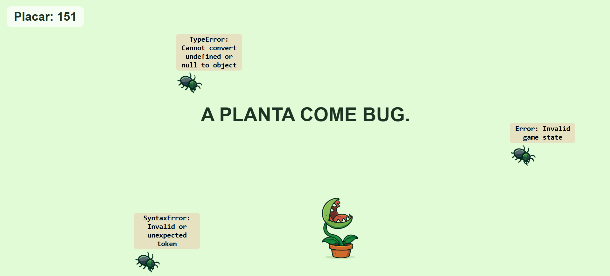
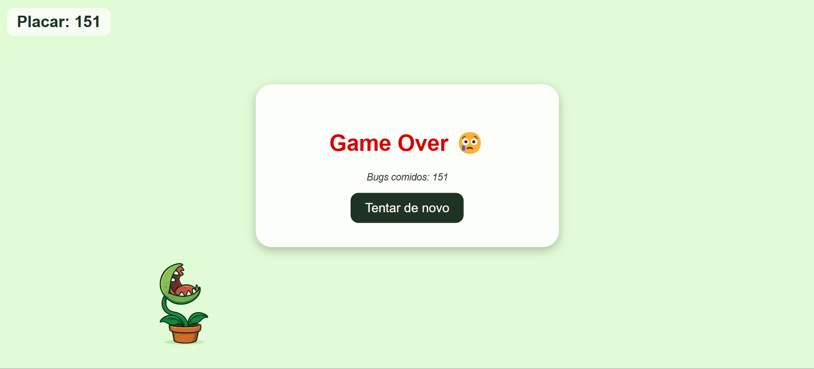

# 🌱 A PLANTA COME BUG 🐛

**A planta carnívora mais programadora que você já viu!**  
Um mini game onde **bugs de programação** são devorados por uma planta! Ideal para devs que adorariam ver os bugs desaparecerem rapidinho. 😅

---

## 🎮 **Como jogar**

- **Movimente a planta** usando as setas do teclado (⬅️ ➡️).
- **Capture os bugs** que aparecem na tela com mensagens de erro.
- **Cada bug comido aumenta o placar**!  
   Tente alcançar o maior número possível.

---

## 🔥 **Screenshots do Jogo**

  
  

---

## 🐞 **Tecnologias Utilizadas**

- **HTML5**  
- **CSS3**  
- **JavaScript**  
- **GitHub Pages** (para hospedar o jogo)

---

## 📚 **Como Contribuir**

Se você deseja contribuir para o projeto, siga as etapas abaixo:

1. **Faça um fork** do repositório.
2. **Clone seu fork** para a sua máquina local.
3. Crie uma nova branch:  
   `git checkout -b feature/feature-name`
4. **Adicione suas mudanças**.
5. **Commit** suas alterações:  
   `git commit -m "feat: adicionar nova funcionalidade"`
6. **Push** para o seu repositório:  
   `git push origin feature/feature-name`
7. **Abra um Pull Request** para o repositório original.

---

> 💡 **Feito com amor por** [@primonmari](https://github.com/primonmari) 🖤
